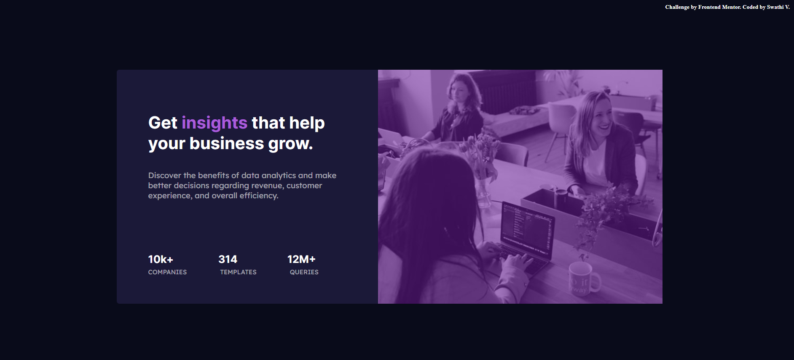

 ## Table of contents

- [Overview](#overview)
  - [The challenge](#the-challenge)
  - [Screenshot](#screenshot)
  - [Links](#links)
- [My process](#my-process)
  - [Built with](#built-with)
  - [What I learned](#what-i-learned)
  - [Useful resources](#useful-resources)
- [Author](#author)

## Overview

### The challenge

Users should be able to:

- View the optimal layout depending on their device's screen size

### Screenshot

### Links

- Solution URL: https://github.com/swathivB/Web-devlopment.git
- Live Site URL: https://swathivb.github.io/Web-design/

## My process

### Built with

- Semantic HTML5 markup
- CSS custom properties
- CSS Grid
- [Styled Components](https://styled-components.com/) - For styles

.

### Useful resources

- https://www.w3schools.com/css/default.asp - This is CSS tutorial. I really liked this pattern and will use it going forward.

## Author

- Frontend Mentor - [@swathivB]

